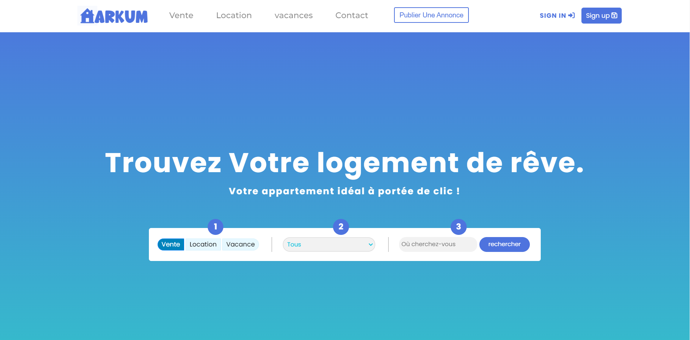
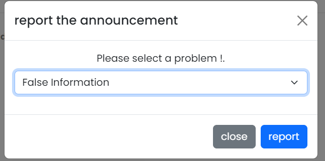
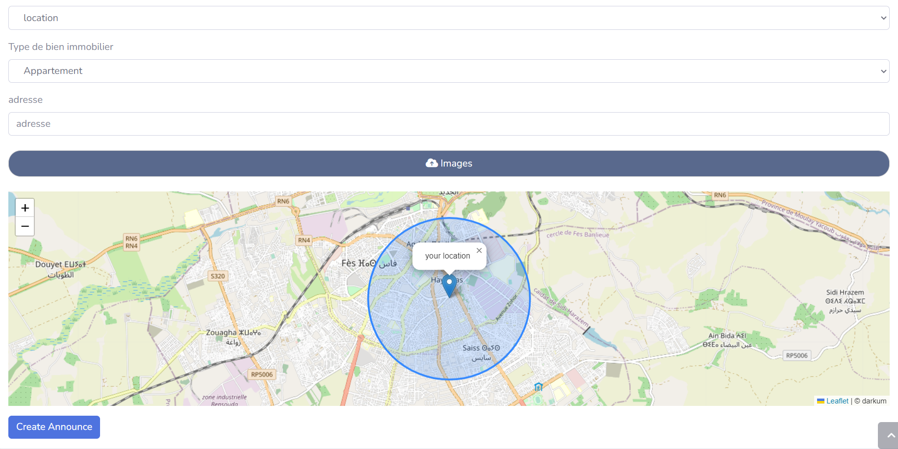

website for apartment rentals designed to solve the problems of apartment search and rental.

## /- Website captures:

## /- Tools I use:
    Programming languages:
<ul>
    <li>html</li>
    <li>css</li>
    <li>php</li>
    <li>javaScript</li>
</ul>

    Technologies & Frameworks:
<ul>
    <li>laravel</li>
    <li>bootstrap</li>
    <li>liveware</li>
    <li>leaflet js</li>
    <li>jira</li>
    <li>vs code</li>
    <li>github</li>
    <li>discord</li>
</ul>

## /- How to install it:

<ul>
    <li>git clone https://github.com/coding-tea/darkum.git</li>
    <li>composer install</li>
    <li>cp .env.example .env</li>
    <li>php artisan migrate:fresh --seed</li>
    <li>npm i</li>
    <li>npm run build</li>
    <li>npm run dev</li>
    <li>php artisan ser</li>
</ul>