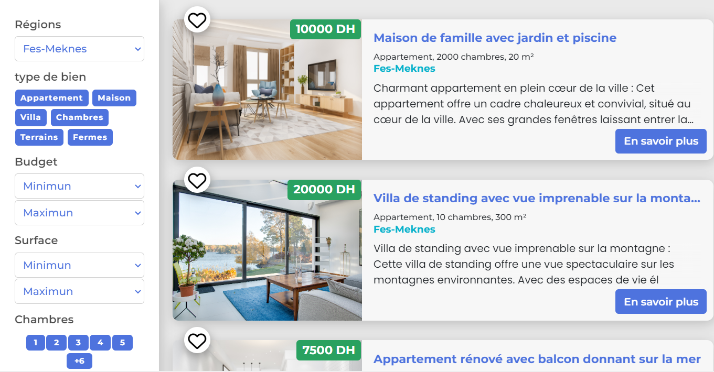
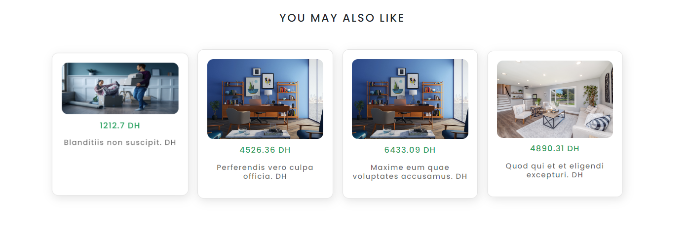
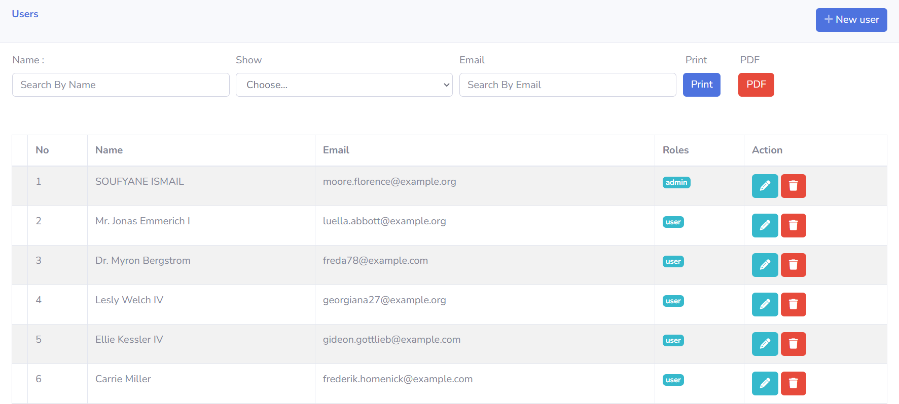

# The Laravel Apartment Rental Site

## Laravel website for apartment rentals designed to solve the problems of apartment search and rental. 
 
## /- About the project: 

This Laravel website for apartment rentals is a solution designed to address the challenges faced during the process of searching for and renting apartments. It aims to simplify and streamline the entire experience. The website provides a user-friendly platform where individuals can effortlessly search for available apartments based on their specific requirements, such as location, size, amenities, and price range. By leveraging the power of Laravel, the website offers a robust and efficient system for landlords and property owners to list their apartments, manage bookings, and communicate with potential tenants. 





## /- Tools I use:

/- Programming languages:

<ul>
    <li>html</li>
    <li>css</li>
    <li>php</li>
    <li>javaScript</li>
</ul>

/-Technologies & Frameworks:

<ul>
    <li>laravel</li>
    <li>bootstrap</li>
    <li>liveware</li>
    <li>leaflet js</li>
    <li>jira</li>
</ul>

## /- How to install it:

```Bash
git clone https://github.com/coding-tea/darkum.git
composer install
cp .env.example .env
php artisan key:generate
php artisan migrate:fresh --seed
npm i
npm run build
npm run dev
php artisan ser
```

## /- How to tweak this project for own uses:

Since this is an example project. I'd encourage you to clone and rename this project to use for your own purposes. It's a good starter boilerplate.

## /- fix a bug:

If you found an issue or would like to submit an improvement to this project, please submit an issue using the issues tag above. If you would like to submit a PR with a fix, reference the issue you created!
